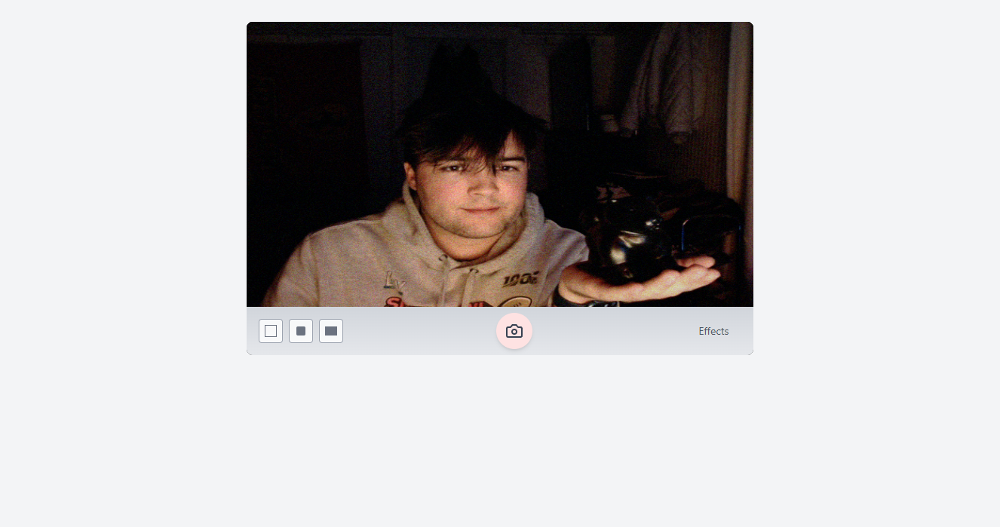

# OGWebcam

A React-based webcam application that recreates the nostalgic aesthetic of early MacBook webcams, complete with characteristic colored noise and retro effects.



## Features

- **Classic MacBook Camera Aesthetic**: Replicates the unique look of early MacBook webcams with authentic colored noise and grain
- **Real-time Effects**: Nine different retro-inspired effects:
  - Sepia
  - Black & White
  - Glow
  - Comic Book
  - Normal (Classic MacBook style)
  - Colored Pencil
  - Thermal Camera
  - X-Ray
  - Pop Art
- **Interactive Effects Grid**: Smooth transitions between effects with a 3x3 preview grid
- **Photo Capture**: Take photos with applied effects
- **Real-time Processing**: All effects are processed in real-time using canvas manipulation

## Installation

```bash
# Clone the repository
git clone https://github.com/yourusername/ogwebcam.git

# Navigate to the project directory
cd ogwebcam

# Install dependencies
npm install

# Start the development server
npm run dev
```

## Tech Stack

- React
- Vite
- Tailwind CSS
- Framer Motion
- Canvas API

## Dependencies

```json
{
  "dependencies": {
    "react": "^18.2.0",
    "react-dom": "^18.2.0",
    "lucide-react": "^0.263.1",
    "framer-motion": "^10.x.x"
  },
  "devDependencies": {
    "@vitejs/plugin-react": "^4.0.3",
    "autoprefixer": "^10.4.14",
    "postcss": "^8.4.27",
    "tailwindcss": "^3.3.3",
    "vite": "^4.4.5"
  }
}
```

## Project Structure

```
ogwebcam/
├── src/
│   ├── components/
│   │   ├── OGWebcam.jsx           # Main webcam component
│   │   └── effects/
│   │       ├── CameraEffectGrid.jsx  # Effects grid layout
│   │       └── [effect components]   # Individual effect components
│   ├── App.jsx
│   └── main.jsx
├── public/
├── index.html
├── package.json
├── vite.config.js
├── tailwind.config.js
└── README.md
```

## Usage

1. Allow camera access when prompted
2. Click the "Effects" button to open the effects grid
3. Choose an effect by clicking on its preview
4. Click the camera button to capture a photo with the current effect
5. Click "Back" to return to the effects grid or normal view

## Development

To add a new effect:

1. Create a new effect component in `src/components/effects/`
2. Add the effect to the `effectsList` in `CameraEffectGrid.jsx`
3. Implement the effect's image processing logic
4. Update the preview grid

## Contributing

1. Fork the repository
2. Create your feature branch (`git checkout -b feature/AmazingFeature`)
3. Commit your changes (`git commit -m 'Add some AmazingFeature'`)
4. Push to the branch (`git push origin feature/AmazingFeature`)
5. Open a Pull Request

## License

This project is licensed under the MIT License - see the [LICENSE](LICENSE) file for details.

## Acknowledgments

- Inspired by the classic MacBook Photo Booth application
- WebRTC and Canvas API documentation
- React and Framer Motion communities

## Contact

Your Name - [@yourtwitter](https://twitter.com/yourtwitter)
Project Link: [https://github.com/yourusername/ogwebcam](https://github.com/yourusername/ogwebcam)
